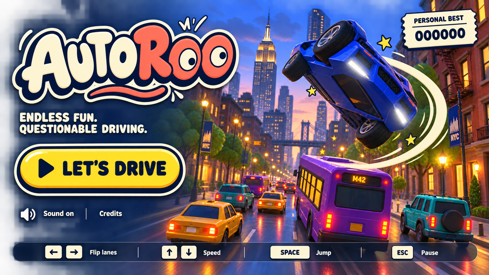
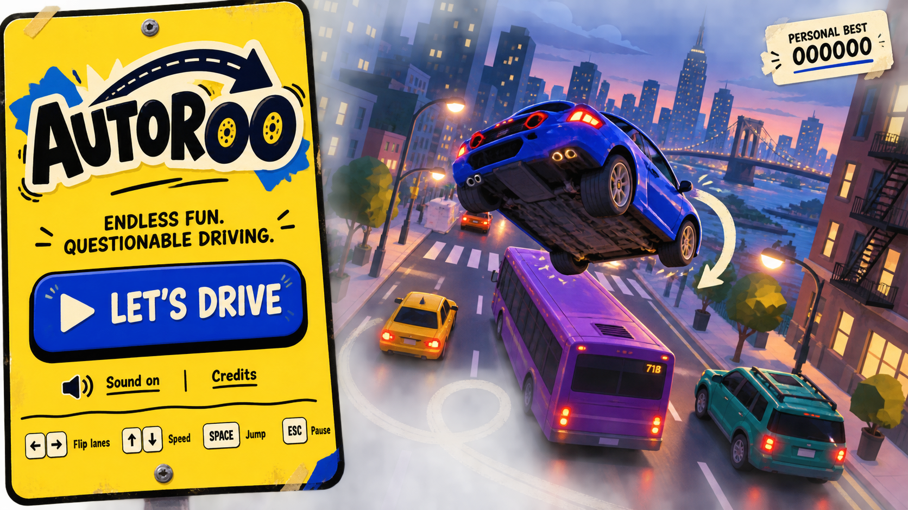
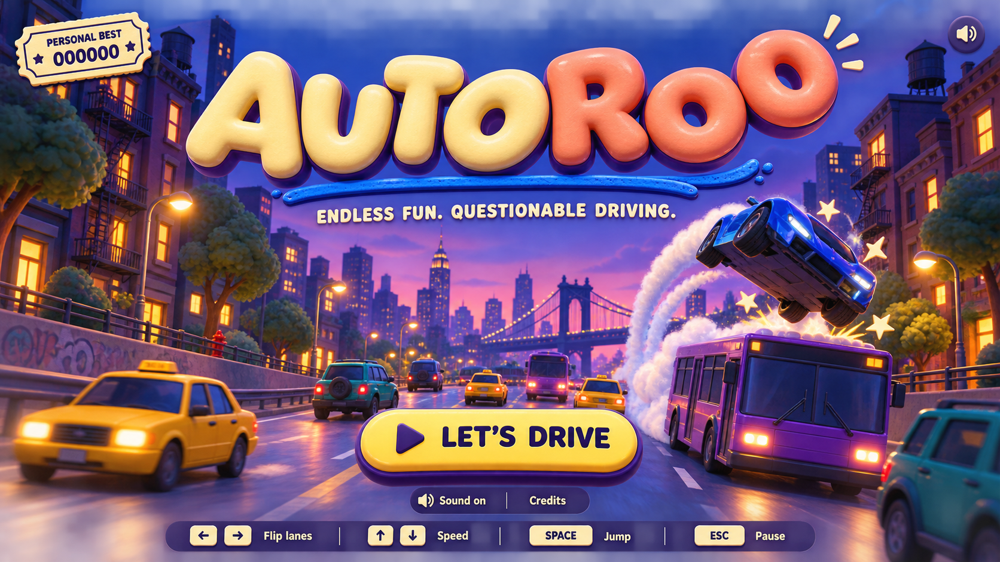

# Autoroo — menu and logo concepts

Three visual directions for review before implementation. Generated with the built-in image-generation tool. The gameplay and production UI are unchanged.

Exact [generation prompts](PROMPTS.md) are saved alongside the mockups. Backgrounds are art-direction illustrations, not captures of the existing game renderer; the chosen identity and layout can be adapted to the existing low-poly city.

## A — Googly Getaway

A bouncing sticker wordmark with googly eyes hidden in the final OO, a bold yellow start button, and a large sideways car flip. The best starting point for bringing the game's physical comedy into the identity while staying close to its night-city setting.

## B — Roadside Nonsense

A crooked yellow sign becomes the menu, with tire-like O letters and a bent road arrow. Graphic, offbeat, and distinctive as a small logo or icon.

## C — Toybox Trouble

An oversized inflated wordmark above a centered menu. Soft 3D lettering and a miniature city give the most tactile, toy-like direction.

## Shared design decisions

- Keep one clear start action, personal best, sound control, and credits.
- Explain lane flips, speed, jump, and pause through a compact keyboard legend.
- Put the barrel roll and bus jump in the artwork: these are actual game mechanics.
- Move the current score and speedometer to gameplay; they carry little information before a run.
- The example personal-best score is 000000, a mockup placeholder.
- The final implementation would retain the current loading state and disabled start action until the city is ready.
- These images are visual concepts; selection comes before interface implementation.
